# Ed‑Fi SIS Certification — How to Use (Bruno GUI)

Audience: SIS vendor testers. Goal: validate your system’s data in the Ed‑Fi API using the SIS scenarios and visually confirm all assertions pass. When all scenarios pass, you are ready for a formal certification session with an Ed‑Fi representative.

---

## Quick Start Checklist

- Install Bruno (GUI) and enable Developer Mode.
- Create `.env` with `EDFI_CLIENT_NAME`, `EDFI_CLIENT_ID`, `EDFI_CLIENT_SECRET`.
- Duplicate an environment file in `bruno/SIS/environments/` and set `baseUrl` and `apiVersion` to your API.
- Open `bruno/SIS/` in Bruno.
- Run baseline “Check” requests in order for each entity; verify all assertions pass.
- Make the required updates/deletes in your SIS and re‑publish.
- Run the corresponding update/delete “Check” requests; verify all assertions pass.
- Contact Ed‑Fi to schedule formal certification.

---

## What You’ll Do

- Prepare data in your SIS and publish to your Ed‑Fi API
- Open the SIS collection in Bruno and select your environment
- Fill in your credentials via a local `.env` file
- Run the SIS scenarios (in order) and visually check all assertions
- If needed, update or delete data in SIS and re‑run scenarios to confirm changes were applied correctly

---

## Prerequisites

- Bruno App installed (GUI). Download from https://www.usebruno.com/
- Access to your Ed‑Fi API (base URL and version)
- OAuth Client Credentials (client name, client ID, client secret)
- Windows/macOS/Linux supported. This guide uses Bruno GUI only (no CLI)

---

## Optional Enhancements

- In a terminal, run `npm install` in the `bruno/` folder to install optional dependencies. This step is optional but can enhance logging and developer tooling when running scenarios.

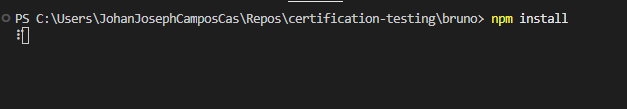

---

## Folder to Open in Bruno

Open the collection folder: `bruno/SIS/`

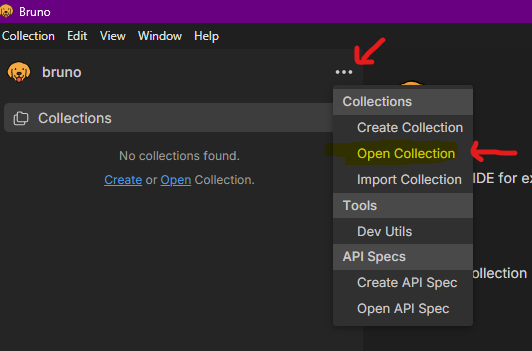

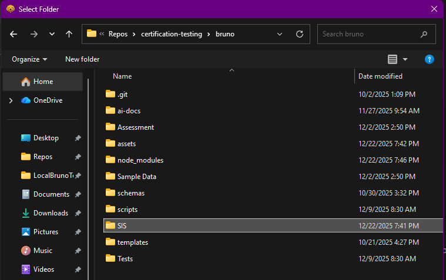

This contains:

- `environments/` with example environment templates you can copy and customize
- `v4/` with entity scenario folders and numbered requests (e.g., `01 - Check ...`)

Tip: Keep Bruno in Developer Mode (Settings → Developer Mode) so scripts and assertions run as designed.

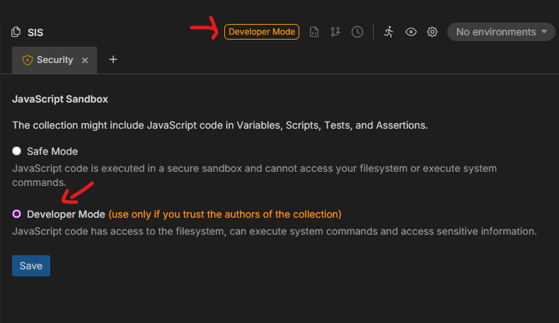

---

## Configure Your Credentials (.env)

To protect your credentials, Bruno reads secrets from a local `.env` file that stays on your machine.

1) Create an `.env` file. Duplicate the template at `bruno/SIS/.env.example` and rename it to `.env`. Bruno supports per‑collection `.env` files; place it at `bruno/SIS/.env`.
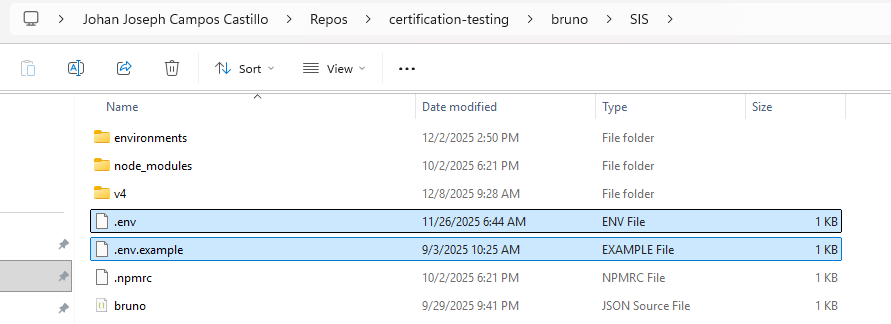
2) Add or Edit in the `.env` file the following keys with your credentials:

```env
EDFI_CLIENT_NAME=YourClientName
EDFI_CLIENT_ID=YourClientId
EDFI_CLIENT_SECRET=YourClientSecret
```

> The `EDFI_CLIENT_NAME` is optional, but it is recommended to include a descriptive name for your own reference.

3) In Bruno, select or edit an environment to match your API version. The environment files are stored under `bruno/SIS/environments/`:

    

- Duplicate and edit any template `.bru` file and adjust `apiVersion` and `baseUrl` to point at your API.
- Use the exact `apiVersion` your API publishes (e.g., `v6.2`, `v7.1`, or newer).
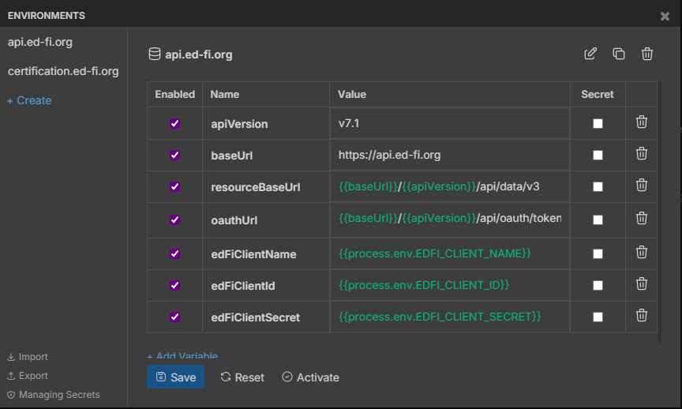
- Select your environment

    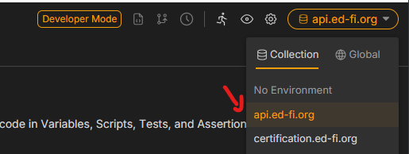

Those environment files define:

- `apiVersion`: set to match your API version
- `baseUrl`: your Ed‑Fi API base, e.g., `https://api.example.org`
- `resourceBaseUrl`: derived data endpoint
- `oauthUrl`: derived OAuth token endpoint
- `edFiClientName`, `edFiClientId`, `edFiClientSecret`: read from your `.env` file.

---

## The Certification Flow (SIS Only)

Follow these steps to self‑certify:

1) In Bruno, select /SIS/\<SIS-version>/\<Group>/\<Entity> and run the numbered “Check” requests for the relevant entities.

    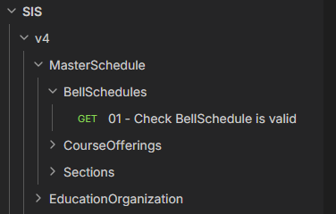

- Open the Entity “Docs” tab for a quick reference. Use it for guidance only and review the official certification documentation for your SIS version: https://docs.ed-fi.org/partners/certification/available-certifications/sis-v4/test-scenarios/

    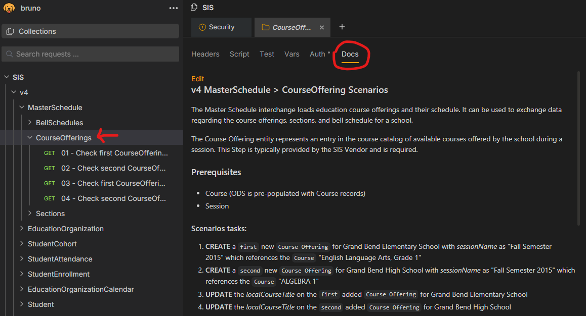

> Folder structure follows this pattern: `/SIS/<SIS-version>/<Group>/<Entity>/<Scenarios>`.
Example: `/SIS/v4/MasterSchedule/BellSchedules/01 - Check BellSchedule is valid.bru`.

2) Generate Data in Your SIS

- Create or load the required records in your SIS (e.g., schools, students, calendars, bell schedules, enrollments).

3) Validate Data with SIS Scenarios (Bruno GUI)

- In Bruno, select the desired \<Entity> and run the numbered `Check...` requests.
- Run in order: files start with `NN - Check <ordinal> <Entity> ...`.
- Edit the scenario `Params` to ensure you are evaluating the right record.
- Send the request to evaluate the response
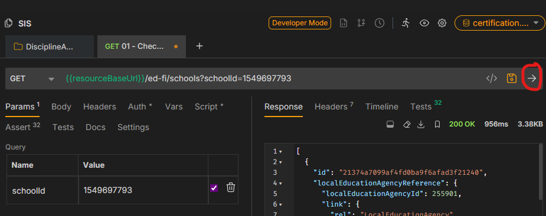
- Each request shows assertions in the `Tests` tab; confirm they all pass visually (green color).

4) Update/Delete Data in Your SIS

- Apply the updates or deletions required for the scenarios (e.g., change a descriptor, add a grade level, remove a record).

5) Validate Updates with SIS Scenarios (Bruno GUI)

- You won't be asked for the input `Params` again, those were added in the previous steps.
- Re‑run the associated `Check ... was Updated` or `... was Deleted` requests.
- Confirm all assertions pass.

When all scenarios across the target entities pass, Phase 1 is complete and you’re ready for a formal certification session.

---

## Running Scenarios in Bruno (Step‑by‑Step)

- Enable Developer Mode (top‑right → Safe Mode → choose Developer Mode → Save).
- Select your environment (any `.bru` file you customized for your API).
- Open an entity folder under `bruno/SIS/v4/` (e.g., `MasterSchedule/BellSchedules/`).
- Start at the lowest number (e.g., `01 - Check first BellSchedule is valid.bru`).
- Press Run. Review the response and the assertions panel.
- If assertions fail, adjust your SIS data and re‑run the scenario.
    
- Continue through update and delete checks where present.

Notes:

- Required fields are asserted automatically; optional fields may be logged but not asserted.
- Scenarios use consistent naming and ordering. Run baseline checks first, then updates, then deletes.

---

## Glossary (Beginner Friendly)

- Environment: A small settings file Bruno uses to know your API address (`baseUrl`) and version (`apiVersion`).
- Params: The input values a request needs (like school, year, calendar code) to find the right record.
- Assertions: Automatic checks that confirm the response has the expected fields and values; Bruno shows them as pass/fail.
- Developer Mode: A Bruno setting that lets the built‑in scripts and richer checks run; turn this on.
- Baseline / Update / Delete: Three types of “Check” requests—baseline confirms records exist and are valid; update confirms a change; delete confirms a record is gone.
- Ordinal: Labels like “first”, “second” in file names to keep scenario steps organized.

---

## Common Inputs (Params)

Some requests include input parameters (e.g., school ID, year, calendar code). In Bruno:
    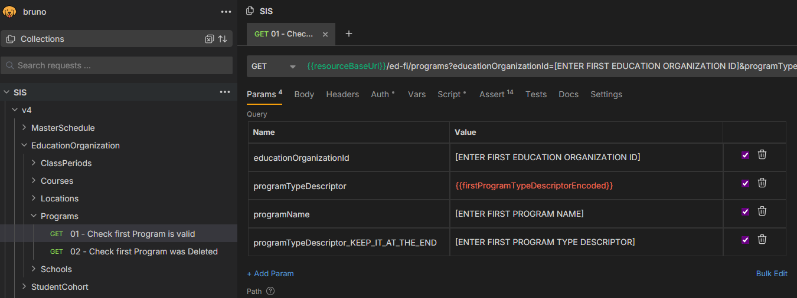

- Open the request and locate the Params section.
- Enter the values that match your SIS data.
- Ensure the parameters are enabled ✅
- Re‑run the request to fetch the specific record.


If a request shows descriptor parameters, just provide the descriptor value when prompted — the request takes care of encoding.

> ⚠️ Important: Descriptor parameters are presented in pairs. Edit `ONLY` the parameter labeled `KEEP_IT_AT_THE_END`. This is a temporary workaround for a known Bruno limitation that requires manual parameter encoding and is planned to be resolved in a future release.

---

## Success Criteria

- Each scenario’s assertions show green/passed in Bruno.
- Baseline checks: the system finds the expected records and asserts required fields.
- Update checks: the scenario confirms the field(s) changed compared to baseline.
- Delete checks: the scenario confirms the record no longer appears.

Once all scenarios pass, contact your Ed‑Fi representative to schedule the formal certification session.

---

## Troubleshooting

- Missing credentials: Ensure `.env` contains `EDFI_CLIENT_NAME`, `EDFI_CLIENT_ID`, `EDFI_CLIENT_SECRET` and you selected the right environment file.
- Wrong environment: Duplicate an environment `.bru` file and set `apiVersion` and `baseUrl` to match your API.
- Assertions failing: Compare the required fields the scenario expects with your SIS data; publish updates, then re‑run.
- Multiple records returned: Narrow with Params (e.g., school, year, code) so the request matches a single record.
- Developer Mode off: Re‑enable Developer Mode; scripts and richer assertions rely on it.
- Unexpected errors: Open the logs via the `Dev Tools` button to inspect details.
    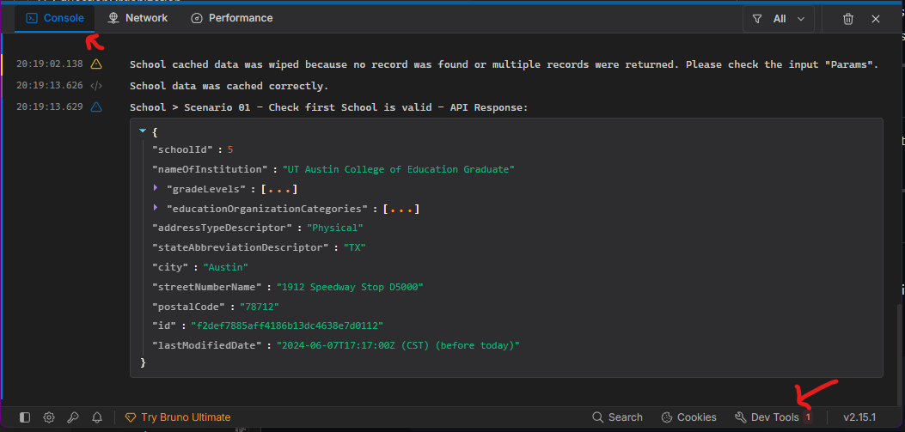

---

## Ready for Formal Certification

Once all SIS scenarios relevant to your implementation pass visually in Bruno, contact your Ed‑Fi representative to schedule the formal certification session.

---

## Appendix (Reference)

- SIS collection: `bruno/SIS/`
- Environments: use any template in `bruno/SIS/environments/` as a starting point, then set `apiVersion` and `baseUrl` to match your API (version‑agnostic)
- Example `.env` keys:

``` json
EDFI_CLIENT_NAME=YourClientName
EDFI_CLIENT_ID=YourClientId
EDFI_CLIENT_SECRET=YourClientSecret
```

This manual aligns with project specifications for scenario naming and assertion behavior and avoids command‑line usage to keep steps simple for end users.